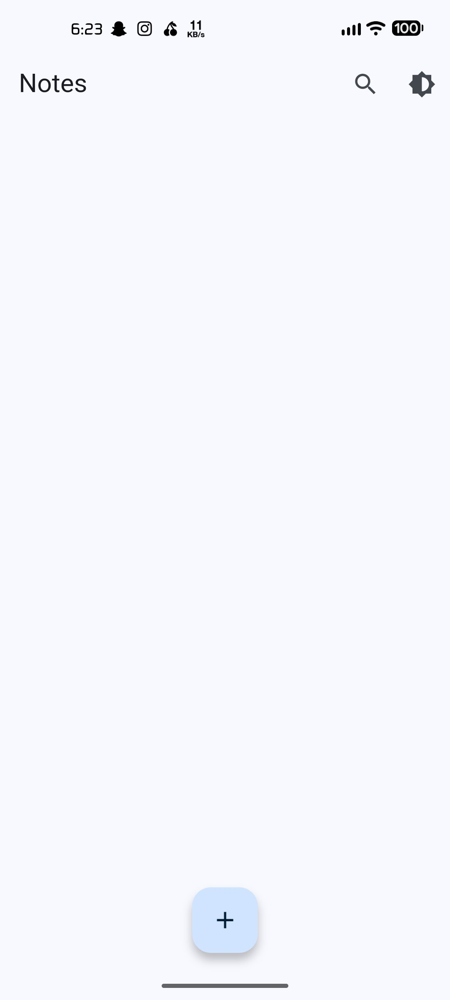
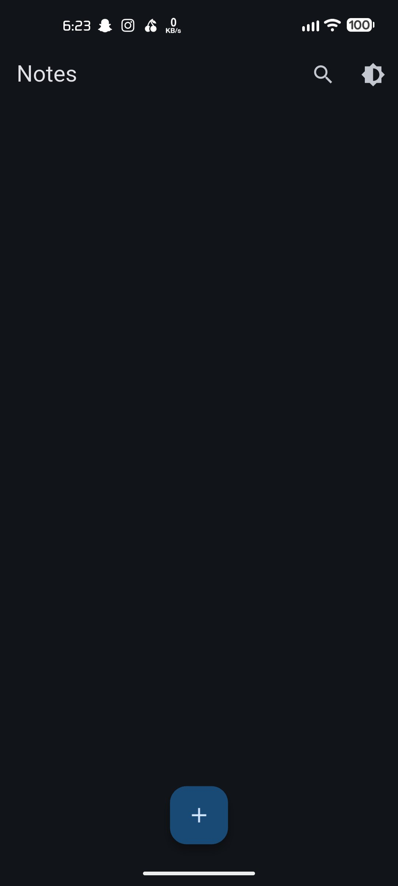
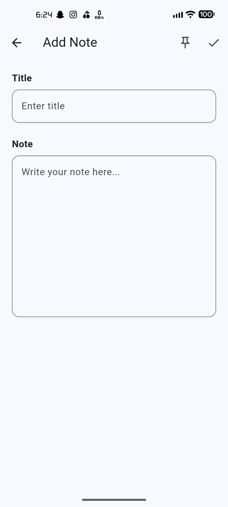
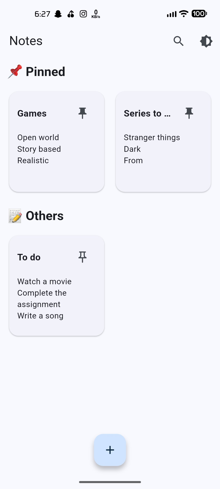
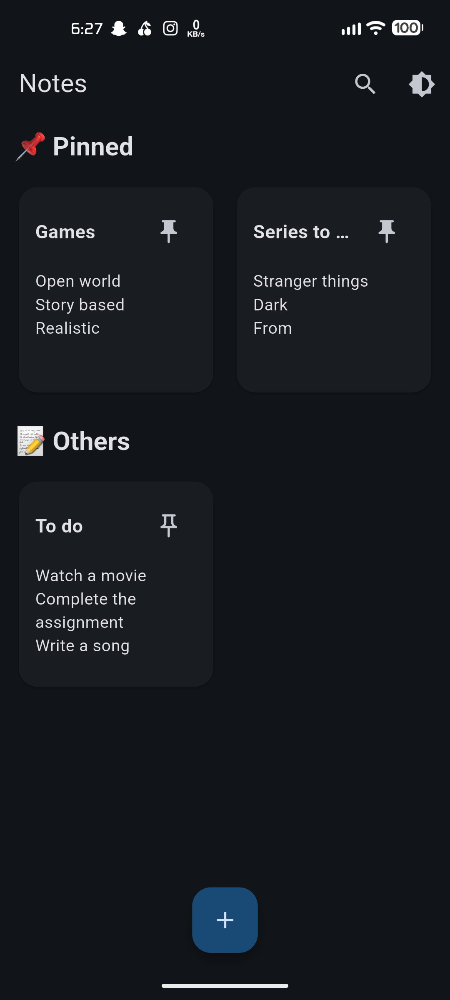
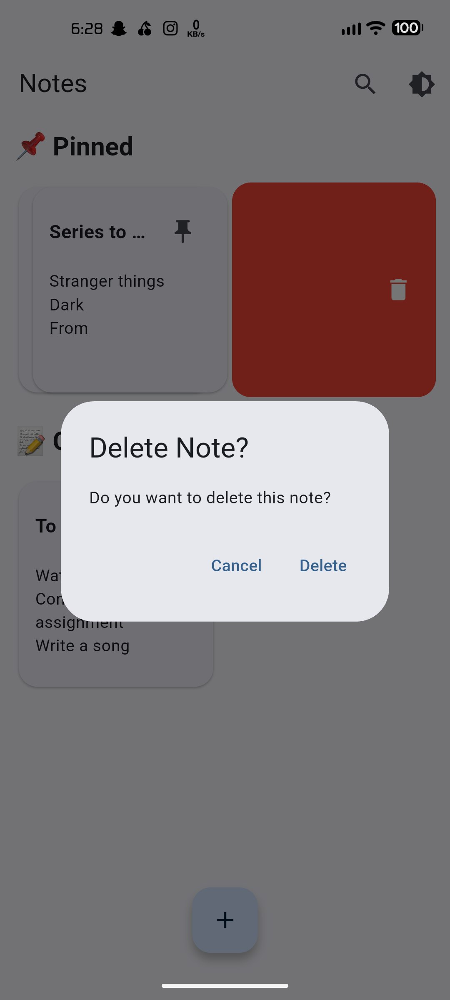
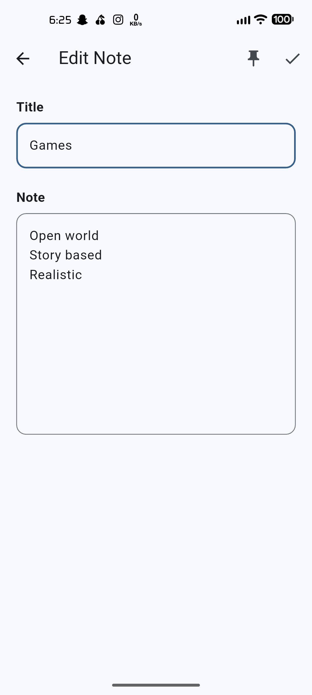
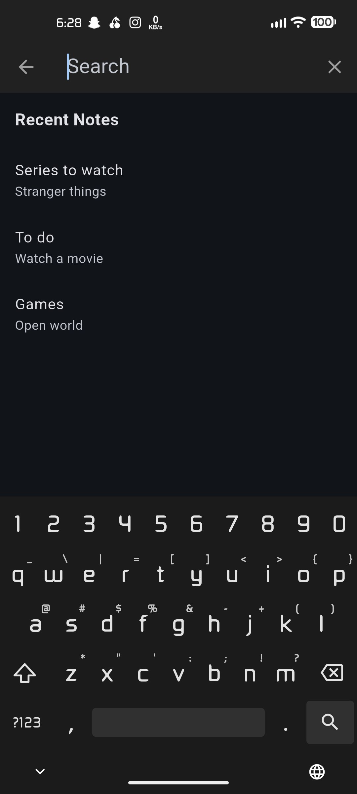
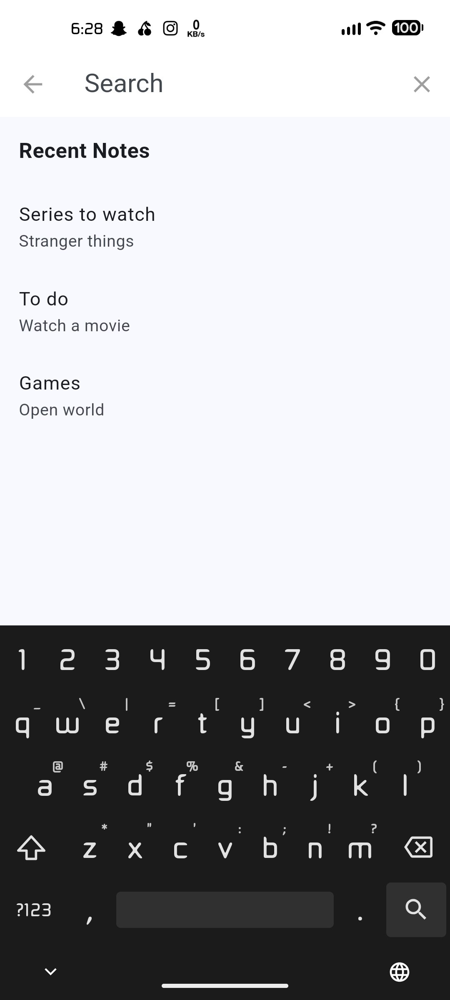

# 📝 A Sample Note App

A clean and minimal Notes App built using **Flutter**.

This app allows users to create, edit, pin, delete, and search notes with a smooth and simple UI.

---

## 🚀 Features

- ➕ Add new notes
- ✏️ Edit existing notes
- 📌 Pin / Unpin notes dynamically
- 🗑 Swipe to delete with confirmation + undo
- 🔍 Smart search with recent notes
- 🌙 Light / Dark theme toggle
- 📱 Responsive grid layout

---

## 📸 Screenshots

  
  
  
   
  
  
  
  
  

